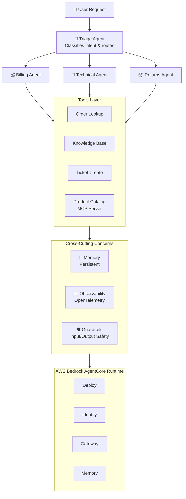
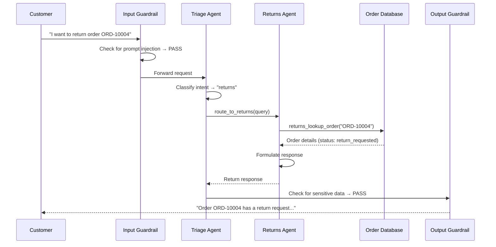

import { Aside } from '@astrojs/starlight/components';

## SupportBot Architecture

Here is the complete architecture of what we'll build across the workshop:

## Component Breakdown

### Triage Agent (Router)

The top-level agent that receives all customer requests. It:
- Classifies the customer's intent (billing, technical, returns)
- Routes to the appropriate specialist agent
- Presents the specialist's response back to the customer

This is the **Agents-as-Tools** pattern, specialist agents are wrapped as callable tools.

### Specialist Agents

Each specialist has domain-specific tools and a focused system prompt:

| Agent | Responsibility | Tools |
|-------|---------------|-------|
| **Billing** | Payments, invoices, pricing | `billing_lookup_order` |
| **Technical** | Product specs, troubleshooting | `tech_search_products`, `tech_search_faq` |
| **Returns** | Returns, shipping, tracking | `returns_lookup_order`, `initiate_return` |

### Tools Layer

Tools are the agent's interface to external systems:

- **`@tool` decorator:** Custom Python functions exposed as tools
- **MCP Server:** Product catalog accessible via the Model Context Protocol
- **Pre-built tools:** From the `strands-agents-tools` package

### Cross-Cutting Concerns

| Concern | Implementation |
|---------|---------------|
| **Memory** | JSON-based persistent storage (production: AgentCore Memory) |
| **Observability** | OpenTelemetry traces + spans for model and tool calls |
| **Safety** | Input guardrails (prompt injection) + output guardrails (data leakage) |
| **Evals** | Test suite with keyword matching + LLM-as-Judge |

### Deployment Layer

Amazon Bedrock AgentCore provides:
- **Runtime:** Serverless agent hosting with 8-hour execution windows
- **Identity:** IAM integration for secure access
- **Gateway:** MCP-compatible tool gateway
- **Memory:** Persistent cross-session memory
- **Observability:** CloudWatch dashboards and metrics

## Data Flow

Here's how a typical request flows through the system:

## Design Decisions

### Why Agents-as-Tools?

We chose the hierarchical pattern over Swarm or Graph because:
- **Simplest to understand** for workshop attendees
- **Clear routing logic**: easy to debug which agent handles what
- **Scales well**: add new specialists without changing the triage agent
- **Natural delegation**: mirrors how real support teams work

### Why MCP for the Product Catalog?

Putting the product catalog in an MCP server demonstrates:
- **Separation of concerns**: catalog is independent from the agent
- **Reusability**: any MCP-compatible agent can use this server
- **Protocol awareness**: understanding stdio/HTTP transport
- **Real-world pattern**: many companies expose APIs as MCP servers

### Why Simple Memory over AgentCore Memory?

We use JSON files for memory in the workshop because:
- **No infrastructure dependency**: works offline
- **Easy to inspect**: just open the JSON file
- **Concept is the same**: swap to AgentCore Memory for production

<Aside type="tip">
The architecture is intentionally progressive. Each module adds a new layer, so you can see how the system evolves from a simple chatbot to a production multi-agent system.
</Aside>
