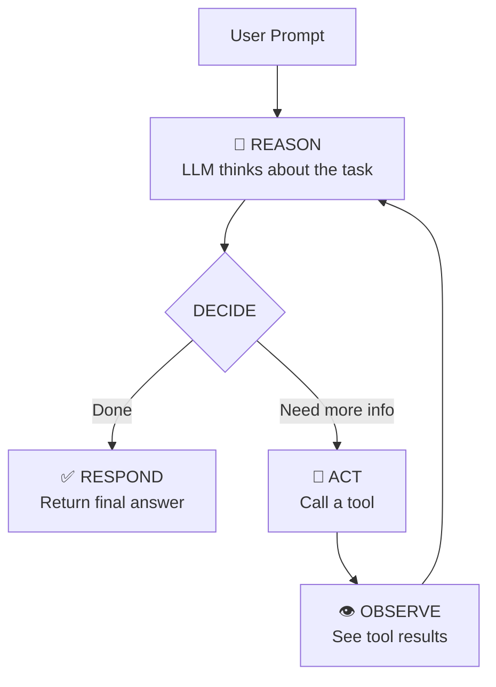
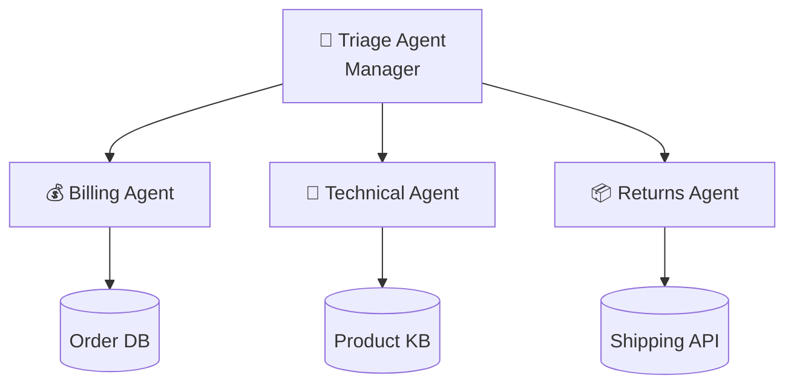

import { Aside, Steps } from '@astrojs/starlight/components';

## What is Agentic AI?

**Agentic AI** refers to AI systems that can autonomously perceive their environment, reason about goals, take actions, and learn from results, going beyond simple question-answering to actually *doing things* in the world.

The key difference from traditional AI chatbots:

| | Chatbot | Copilot | Agent | Autonomous Agent |
|---|---------|---------|-------|------------------|
| **Input** | Text | Text + Context | Text + Goals | Goals only |
| **Reasoning** | Single-turn | Multi-turn | Multi-step planning | Self-directed |
| **Actions** | Reply | Suggest | Execute with approval | Execute independently |
| **Tools** | None | Limited | Multiple | Dynamic selection |
| **Memory** | None | Session | Persistent | Learning |

## The Agentic Loop

At its core, every AI agent runs a loop:



This **Reason → Act → Observe** loop continues until the agent decides it has enough information to give a final response. This is the fundamental pattern behind frameworks like ReAct (Reasoning + Acting).

## Core Components of an Agent

### 1. Language Model (The Brain)

The LLM provides reasoning, planning, and natural language understanding. In this workshop, we use **Amazon Bedrock** with **Claude Sonnet** as our model provider.

```python
from strands import Agent

# The model is the brain - it reasons about what to do
agent = Agent()  # Uses Bedrock Claude Sonnet by default
```

### 2. System Prompt (The Personality)

The system prompt defines *who* the agent is, *what* it can do, and *how* it should behave. Think of it as the agent's job description.

```python
agent = Agent(
    system_prompt="You are a helpful customer support agent for TechStore..."
)
```

### 3. Tools (The Hands)

Tools give agents the ability to interact with the outside world: search databases, call APIs, read files, execute code, and more.

```python
from strands import tool

@tool
def lookup_order(order_id: str) -> dict:
    """Look up a customer order."""
    return database.get_order(order_id)

agent = Agent(tools=[lookup_order])
```

### 4. Memory (The Recall)

Memory enables agents to remember past interactions, user preferences, and learned information across conversations.

- **Short-term memory:** Current conversation context
- **Long-term memory:** Persistent storage across sessions
- **Episodic memory:** Learning from past experiences

### 5. Orchestration (The Coordination)

For complex tasks, multiple agents can collaborate, each specializing in a domain, coordinated by an orchestrator.

## Agent Architecture Patterns

### ReAct (Reasoning + Acting)

The most common pattern. The agent interleaves reasoning and action steps:
1. **Think** about what to do
2. **Act** by calling a tool
3. **Observe** the result
4. **Repeat** until done

This is what Strands Agents uses by default. The LLM naturally reasons and selects tools in a loop.

### Plan-and-Execute

A more structured approach where the agent:
1. **Plans** the entire strategy upfront
2. **Executes** each step of the plan
3. **Revises** the plan if something goes wrong

This can reduce costs by using a capable model for planning and a cheaper model for execution.

### Reflexion

An iterative improvement pattern:
1. Agent generates a response
2. A critic evaluates the response
3. Agent refines based on feedback
4. Repeat until quality threshold is met

### ReWOO (Reasoning Without Observation)

Separates planning from execution entirely:
1. **Planner** creates a full execution plan with all tool calls
2. **Worker** executes all tool calls in parallel
3. **Solver** synthesizes results into a final answer

<Aside type="tip">
Strands Agents uses the ReAct pattern by default, which works well for most use cases. The SDK also supports custom orchestration for Plan-and-Execute and other patterns.
</Aside>

## Multi-Agent Patterns

When a single agent isn't enough, you can compose multiple agents:

### Agents-as-Tools (Hierarchical)

A manager agent delegates subtasks to specialist agents. Each specialist is wrapped as a tool the manager can call.



### Swarm

Agents dynamically hand off control based on the conversation flow. No central coordinator, agents decide when to transfer.

### Graph

Agents are connected in a directed graph with explicit edges defining the flow. The `GraphBuilder` class in Strands makes this easy.

### Workflow

A predefined sequence of agent steps. Each agent performs its role and passes results to the next.

## Contemporary Concepts

### Model Context Protocol (MCP)

MCP is an open standard that lets agents discover and use tools from any MCP-compatible server. Think of it as "USB for AI tools". Plug in any server, and the agent can use its tools.

```python
from strands.tools.mcp import MCPClient

# Connect to any MCP server
mcp_client = MCPClient(server_params)
tools = mcp_client.list_tools()  # Discover available tools
```

### Skills.md Pattern

A modular approach to agent capabilities. Each skill is a folder with a `SKILL.md` file containing:
- **Frontmatter:** Name, description (lightweight, always loaded)
- **Body:** Full instructions (loaded on demand when the skill is needed)

This keeps the context window lean, hundreds of skills can be registered while only loading what's needed.

### Hierarchical Context Management

Managing the context window efficiently across multiple levels:
- **L1 (Active):** System prompt + current conversation (always in context)
- **L2 (On-demand):** Skills, FAQ, policies (loaded via tool calls)
- **L3 (External):** Databases, APIs, knowledge bases (accessed through tools)

### Agent Evaluations (Evals)

Testing agents is fundamentally different from testing traditional software because agents make non-deterministic decisions. Key evaluation dimensions:

- **Task Completion:** Did the agent solve the problem?
- **Tool Selection:** Did it use the right tools?
- **Reasoning Quality:** Was the reasoning logical?
- **Safety:** Did it avoid harmful outputs?
- **Efficiency:** How many steps/tokens did it use?

### Observability

Production agents need deep observability:
- **Traces:** End-to-end request traces (OpenTelemetry)
- **Spans:** Individual model calls, tool calls, agent handoffs
- **Metrics:** Latency, token usage, error rates
- **Logs:** Reasoning steps, tool inputs/outputs

## What We'll Build

In this workshop, you'll build **SupportBot**, a multi-agent customer support system that demonstrates all these concepts:

1. **Single agent** with a system prompt (Module 1)
2. **Custom tools** + MCP server (Module 2)
3. **Memory** and context management (Module 3)
4. **Multi-agent** triage system (Module 4)
5. **Evals, safety**, and observability (Module 5)
6. **Deploy** to AWS AgentCore (Module 6)

Each module builds on the previous one, so by the end you'll have a production-ready agentic system.
