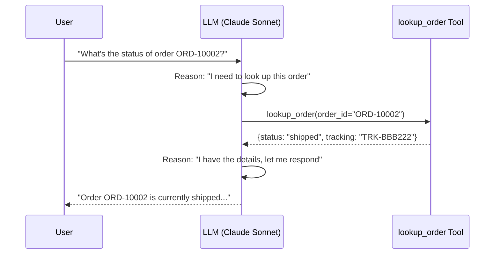

import { Steps, Aside } from '@astrojs/starlight/components';

## Learning Objectives

- Create custom tools using the `@tool` decorator
- Understand tool schemas (docstrings → LLM-readable descriptions)
- Build an MCP server with FastMCP
- Connect an agent to an MCP server
- See the full agentic loop with tool calling

## Part A: Custom Tools

### How Tools Work

When you decorate a function with `@tool`, Strands:
1. Extracts the **function name** → tool name
2. Parses the **docstring** → tool description for the LLM
3. Reads **type hints** → parameter schema
4. Registers it as a callable tool in the agent loop

```python
from strands import tool

@tool
def lookup_order(order_id: str) -> dict:
    """Look up a customer order by its order ID.

    Args:
        order_id: The order ID to look up (e.g., ORD-10001)
    """
    # Your implementation here
    return {"status": "delivered", ...}
```

The LLM sees the tool description and decides when to call it based on the user's request.

### Hands-On: Agent with Tools

<Steps>

1. **Open the tools module**

   ```bash
   code module_02_tools_mcp/tools.py
   ```

2. **Review the custom tools**

   We define 5 tools:
   - `lookup_order`: Find order by ID
   - `search_products`: Search the product catalog
   - `search_faq`: Search the knowledge base
   - `create_support_ticket`: Create a ticket for escalation
   - `check_product_availability`: Check stock status

3. **Run the agent with tools**

   ```bash
   python module_02_tools_mcp/tools.py
   ```

4. **Test tool-calling behavior**

   ```
   You: What's the status of order ORD-10002?
   You: Do you have any headphones in stock?
   You: What's your return policy?
   You: I need to report a defective product, my name is Carol and email is carol@example.com
   ```

</Steps>

Notice how the agent **automatically decides** which tool to call based on your question. This is the model-driven approach, the LLM reasons about which tool is relevant.

### The Tool-Calling Loop



## Part B: Building an MCP Server

### What is MCP?

The **Model Context Protocol** is an open standard for exposing tools to AI agents. Think of it as USB-C for AI tools, any MCP server works with any MCP client.

### Hands-On: Build an MCP Server

<Steps>

1. **Open the MCP server**

   ```bash
   code module_02_tools_mcp/mcp_server.py
   ```

2. **Review the server implementation**

   We use **FastMCP** to create a server that exposes product catalog tools:

   ```python
   from fastmcp import FastMCP

   mcp = FastMCP(name="TechStore Catalog Server")

   @mcp.tool()
   def get_product_details(sku: str) -> dict:
       """Get product info by SKU."""
       return PRODUCTS[sku]

   @mcp.resource("catalog://categories")
   def list_categories() -> str:
       """List available categories."""
       return "Electronics, Furniture, Accessories"
   ```

   MCP servers expose **tools** (callable functions) and **resources** (static data).

3. **Open the MCP-connected agent**

   ```bash
   code module_02_tools_mcp/agent_with_mcp.py
   ```

4. **Review the MCP connection**

   ```python
   from strands.tools.mcp import MCPClient
   from mcp import StdioServerParameters

   mcp_client = MCPClient(
       StdioServerParameters(
           command="python",
           args=["mcp_server.py"],
       )
   )

   with mcp_client:
       mcp_tools = mcp_client.list_tools()
       agent = Agent(tools=[search_faq, *mcp_tools])
   ```

   The agent now has tools from **two sources**: a local `@tool` function and MCP server tools.

5. **Run the MCP-connected agent**

   ```bash
   python module_02_tools_mcp/agent_with_mcp.py
   ```

6. **Test MCP tools**

   ```
   You: Show me all electronics products
   You: What's the status of order ORD-10001?
   You: Search for webcam
   ```

</Steps>

### MCP Transport Types

| Transport | Use Case | How It Works |
|-----------|----------|--------------|
| **stdio** | Local servers, CLI tools | Subprocess via stdin/stdout |
| **Streamable HTTP** | Remote servers, web services | HTTP POST/GET requests |
| **SSE** | Streaming, real-time updates | Server-Sent Events |

In this workshop we use stdio (simplest). In production, you'd typically use HTTP for remote MCP servers.

<Aside type="tip">
The beauty of MCP is that your product catalog MCP server could be used by *any* agent in your organization, not just this support bot. It's a reusable building block.
</Aside>

## Key Takeaways

- Tools extend agents from "answering" to "doing"
- The `@tool` decorator turns any Python function into an agent tool
- MCP separates tool servers from agents for reusability
- Agents can combine tools from multiple sources (local + MCP)
- The LLM decides which tool to call based on context
