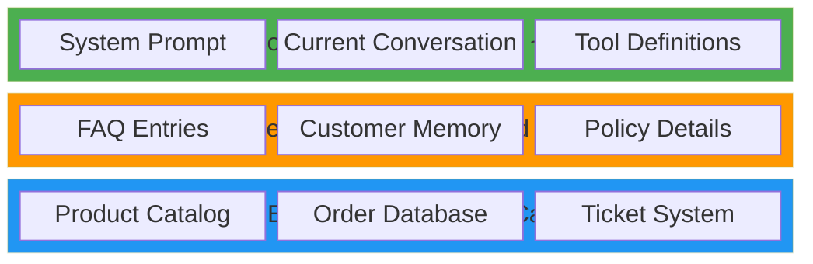

import { Steps, Aside } from '@astrojs/starlight/components';

## Learning Objectives

- Understand the types of agent memory
- Implement persistent customer memory
- Learn hierarchical context management (L1/L2/L3)
- Understand token optimization strategies
- Explore the Skills.md pattern for modular context

## Types of Agent Memory

| Type | Scope | Example |
|------|-------|---------|
| **Conversation** | Current session | Chat history within one interaction |
| **Short-term** | Recent sessions | User's last few requests |
| **Long-term** | Persistent | Customer preferences, past orders |
| **Episodic** | Learning | "Last time this customer had a billing issue, they needed..." |

Strands Agents maintains conversation memory automatically within a session. For persistent memory, we implement our own storage (or use AgentCore Memory in production).

## Hands-On: Memory-Aware Agent

<Steps>

1. **Open the memory module**

   ```bash
   code module_03_memory/agent_with_memory.py
   ```

2. **Review the memory tools**

   We create two tools for persistent memory:

   ```python
   @tool
   def remember_customer_preference(
       customer_id: str, key: str, value: str
   ) -> dict:
       """Store a customer preference for future interactions."""
       memory = load_memory()
       memory[customer_id][key] = value
       save_memory(memory)
       return {"stored": True, ...}

   @tool
   def recall_customer_info(customer_id: str) -> dict:
       """Recall stored info about a customer."""
       memory = load_memory()
       return memory.get(customer_id, {})
   ```

3. **Run the memory agent**

   ```bash
   python module_03_memory/agent_with_memory.py
   ```

4. **Test memory across conversations**

   ```
   You: Hi, I'm Alice. I prefer email communication and love electronics.
   You: What do you remember about Alice?
   You: What headphones do you have?
   ```

   Now restart the agent and ask again:
   ```
   You: What do you know about Alice?
   ```

   The memory persists across sessions because it's stored in a JSON file.

</Steps>

## Hierarchical Context Management

One of the most important concepts in production agents is **managing the context window efficiently**. LLMs have limited context windows, and every token costs money.

### The Three-Level Pattern



**L1 (Always loaded):** The system prompt and tool descriptions are always in context. Keep this lean, ~200-500 tokens for the prompt.

**L2 (Loaded on demand):** Detailed information loaded only when the agent calls a tool. FAQ entries, customer preferences, and detailed policies live here.

**L3 (External):** Full databases and APIs accessed through tool calls. Only relevant slices of data enter the context.

### Token Optimization Strategies

| Strategy | How | Savings |
|----------|-----|---------|
| **Progressive disclosure** | Load details only when needed | 60-80% |
| **Response summarization** | Summarize long tool outputs | 30-50% |
| **Focused tool output** | Return only relevant fields | 20-40% |
| **Context pruning** | Drop old conversation turns | Variable |
| **Skills.md pattern** | Frontmatter always loaded, body on demand | 70-90% |

### The Skills.md Pattern

The Skills.md pattern (popularized by Anthropic's Claude Code) is a powerful context management technique:

```
skills/
├── billing/
│   └── SKILL.md       # Frontmatter: name + description (always visible)
│                       # Body: full instructions (loaded on demand)
├── returns/
│   └── SKILL.md
└── technical/
    └── SKILL.md
```

**Frontmatter** (lightweight, always in context):
```yaml
---
name: billing-support
description: Handle billing inquiries, payment issues, and refunds
---
```

**Body** (loaded only when the skill is activated):
```markdown
## Instructions
When handling billing inquiries:
1. Always look up the order first
2. Verify customer identity
3. Check refund eligibility...
```

This lets you register hundreds of skills while keeping the context window lean, only the names and descriptions are always visible.

<Aside type="tip">
In our workshop, the system prompt + tool descriptions act as L1. The FAQ search tool acts as L2. Product/order lookups are L3. This mirrors the Skills.md approach without extra infrastructure.
</Aside>

## AgentCore Memory (Production)

In production, you'd replace the JSON file with Amazon Bedrock AgentCore Memory:

```python
# Conceptual - AgentCore Memory integration
from bedrock_agentcore.memory import AgentCoreMemory

memory = AgentCoreMemory(agent_id="supportbot")
memory.store("alice", {"preference": "email", "interests": "electronics"})
info = memory.recall("alice")
```

AgentCore Memory supports:
- **Semantic memory:** Factual knowledge about customers
- **Episodic memory:** Learning from past interactions
- **Cross-session persistence:** Memory survives agent restarts
- **Automatic indexing:** Find relevant memories by context

## Key Takeaways

- Memory transforms agents from stateless to personalized
- Use hierarchical context (L1/L2/L3) to manage token budgets
- The Skills.md pattern enables scalable, modular agent capabilities
- Always load context on-demand, don't stuff everything into the prompt
- In production, use AgentCore Memory for persistent, scalable storage
