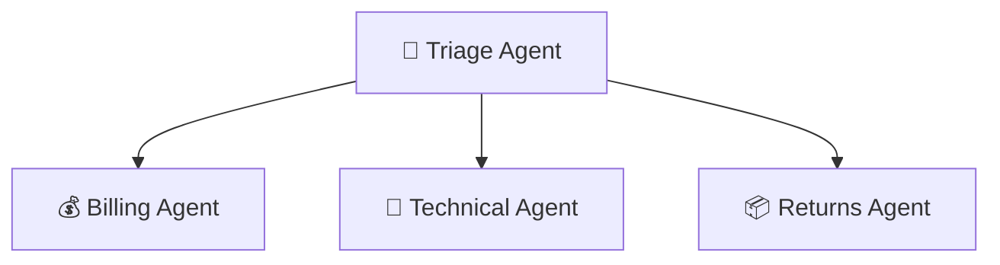
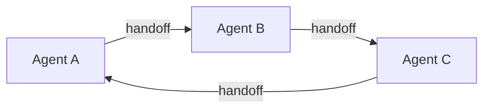
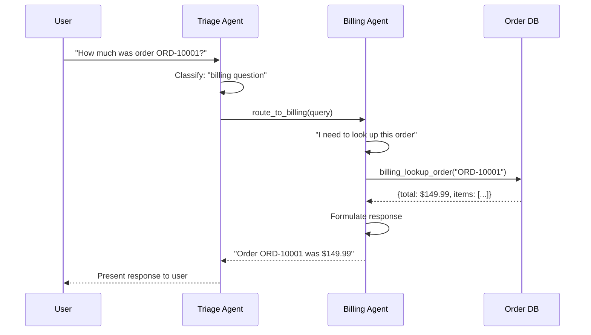
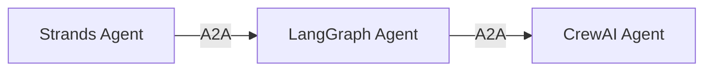

import { Steps, Aside } from '@astrojs/starlight/components';

## Learning Objectives

- Understand multi-agent architecture patterns
- Implement the Agents-as-Tools (hierarchical delegation) pattern
- Build specialist agents for billing, technical support, and returns
- Create a triage agent that routes to the right specialist
- Understand when to use different multi-agent patterns

## Why Multi-Agent?

Single agents work well for simple tasks, but complex domains benefit from **specialization**:

| Single Agent | Multi-Agent |
|--------------|-------------|
| One large system prompt | Focused prompts per domain |
| All tools available at once | Domain-specific tool subsets |
| Risk of confusion with many tools | Clear separation of concerns |
| Hard to maintain at scale | Easy to add new specialists |

## Multi-Agent Patterns

### 1. Agents-as-Tools (What We'll Build)

A **manager agent** delegates to **specialist agents** wrapped as tools:



**Best for:** Clear domain boundaries, customer support, help desks

### 2. Swarm

Agents dynamically hand off control. No central coordinator.



**Best for:** Conversational flows, progressive disclosure

### 3. Graph

Agents connected in a directed graph with explicit edges:

```python
from strands.multiagent import GraphBuilder

graph = GraphBuilder()
graph.add_node("research", research_agent)
graph.add_node("analyze", analysis_agent)
graph.add_edge("research", "analyze")
```

**Best for:** Complex workflows, data pipelines

### 4. Workflow

A predefined sequence where each agent performs a step:

```
Plan Agent → Execute Agent → Review Agent → Output
```

**Best for:** Content generation, code review, quality assurance

## Hands-On: Building the Multi-Agent System

<Steps>

1. **Open the multi-agent module**

   ```bash
   code module_04_multi_agent/triage_agent.py
   ```

2. **Review the specialist agents**

   Each specialist has a focused system prompt and domain-specific tools:

   ```python
   billing_agent = Agent(
       system_prompt="You are a Billing Specialist...",
       tools=[billing_lookup_order],
   )

   technical_agent = Agent(
       system_prompt="You are a Technical Support Specialist...",
       tools=[tech_search_products, tech_search_faq],
   )

   returns_agent = Agent(
       system_prompt="You are a Returns & Shipping Specialist...",
       tools=[returns_lookup_order, initiate_return],
   )
   ```

3. **Review the routing tools**

   Specialist agents are wrapped as tools for the triage agent:

   ```python
   @tool
   def route_to_billing(query: str) -> str:
       """Route to Billing Specialist for payment questions."""
       response = billing_agent(query)
       return response.message.content[0]["text"]

   @tool
   def route_to_technical(query: str) -> str:
       """Route to Technical Support for product questions."""
       response = technical_agent(query)
       return response.message.content[0]["text"]
   ```

4. **Review the triage agent**

   The triage agent's only job is classification and routing:

   ```python
   triage_agent = Agent(
       system_prompt="Your ONLY job is to classify intent and route...",
       tools=[route_to_billing, route_to_technical, route_to_returns],
   )
   ```

5. **Run the multi-agent system**

   ```bash
   python module_04_multi_agent/triage_agent.py
   ```

6. **Test routing behavior**

   ```
   You: How much did I pay for order ORD-10001?
   → Routes to Billing Agent

   You: Does the webcam work with Linux?
   → Routes to Technical Agent

   You: I want to return order ORD-10004
   → Routes to Returns Agent

   You: Hello!
   → Triage greets and asks how to help
   ```

</Steps>

## What's Happening Under the Hood

When you ask a billing question:



This is **two levels of the agentic loop**, the triage agent's loop calls a tool that runs another agent's loop.

<Aside type="note">
Notice each specialist agent only has its relevant tools. The billing agent can't initiate returns, and the returns agent can't answer technical questions. This is the principle of **least privilege** applied to agents.
</Aside>

## A2A Protocol

For cross-framework agent communication, Strands supports the **Agent-to-Agent (A2A)** protocol. This lets agents built with different frameworks (Strands, LangGraph, CrewAI) communicate:



AgentCore Runtime has built-in A2A support, making it easy to compose agents from different teams or vendors.

## Key Takeaways

- Multi-agent systems enable specialization and separation of concerns
- Agents-as-Tools is the simplest multi-agent pattern to implement
- Each specialist should have a focused prompt and relevant tools only
- The triage agent is just a classifier + router, it doesn't answer questions itself
- Strands supports Swarm, Graph, and Workflow patterns for more complex needs
- A2A protocol enables cross-framework agent collaboration
