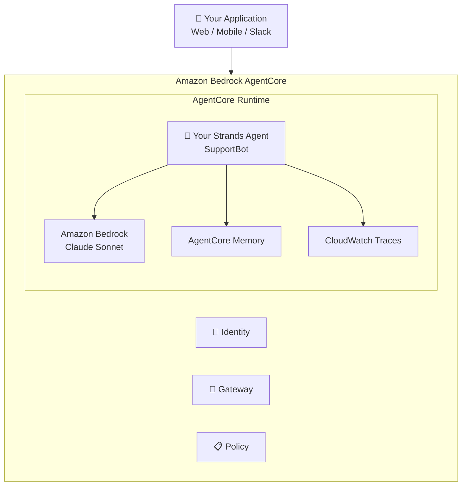

import { Steps, Aside } from '@astrojs/starlight/components';

## Learning Objectives

- Understand Amazon Bedrock AgentCore Runtime
- Wrap a Strands agent for production deployment
- Deploy using the AgentCore starter toolkit
- Understand alternative deployment options (FastAPI + Docker)

## Amazon Bedrock AgentCore

AgentCore is AWS's managed platform for deploying AI agents. Key features:

| Feature | Description |
|---------|-------------|
| **Runtime** | Serverless hosting, up to 8-hour execution windows |
| **Gateway** | Convert APIs to MCP tools automatically |
| **Identity** | Auth via Cognito, Okta, Entra ID |
| **Memory** | Persistent cross-session memory |
| **Observability** | CloudWatch dashboards |
| **Policy** | Natural language guardrails |
| **Evaluations** | 13 pre-built eval metrics |

## Option A: AgentCore Starter Toolkit

The fastest way to deploy.

<Steps>

1. **Install the toolkit**

   ```bash
   pip install bedrock-agentcore-starter-toolkit
   ```

2. **Review the deployment entry point**

   ```bash
   code module_06_deploy/app.py
   ```

   The key addition is the `BedrockAgentCoreApp` wrapper:

   ```python
   from bedrock_agentcore.runtime import BedrockAgentCoreApp

   agent = Agent(
       system_prompt=SYSTEM_PROMPT,
       tools=[lookup_order, search_products, search_faq, create_support_ticket],
   )

   app = BedrockAgentCoreApp(agent=agent)
   ```

3. **Configure the deployment**

   ```bash
   cd workshop
   agentcore configure -e module_06_deploy/app.py
   ```

   This creates deployment configuration files targeting `us-east-1`.

4. **Deploy to AgentCore**

   ```bash
   agentcore launch
   ```

   Wait for deployment to complete (typically 2-5 minutes).

5. **Check deployment status**

   ```bash
   agentcore status
   ```

6. **Invoke the deployed agent**

   ```bash
   agentcore invoke '{"prompt": "What is your return policy?"}'
   agentcore invoke '{"prompt": "Check order ORD-10001"}'
   ```

</Steps>

<Aside type="note">
The AgentCore Runtime provides session isolation, so each invocation runs in its own environment. Sessions can last up to 8 hours for complex tasks.
</Aside>

## Option B: FastAPI + Docker

For full control over the HTTP interface.

<Steps>

1. **Review the FastAPI app**

   ```bash
   code module_06_deploy/app_fastapi.py
   ```

   Key endpoints:
   - `GET /ping`: Health check (required by AgentCore)
   - `POST /invocations`: Invoke the agent

2. **Run locally**

   ```bash
   pip install fastapi uvicorn
   uvicorn module_06_deploy.app_fastapi:app --host 0.0.0.0 --port 8080
   ```

3. **Test with curl**

   ```bash
   curl -X POST http://localhost:8080/invocations \
     -H "Content-Type: application/json" \
     -d '{"prompt": "What is your return policy?"}'
   ```

4. **Build Docker container** (optional)

   ```bash
   docker build -t supportbot -f module_06_deploy/Dockerfile .
   docker run -p 8080:8080 supportbot
   ```

</Steps>

## Deployment Architecture



## Other Deployment Options

| Target | How | Best For |
|--------|-----|----------|
| **AgentCore** | `agentcore launch` | Managed, serverless |
| **AWS Lambda** | Wrap with Lambda handler | Short tasks, event-driven |
| **AWS Fargate** | Docker container on ECS | Long-running, custom infra |
| **AWS EKS** | Kubernetes deployment | Large-scale, existing K8s |
| **Docker** | Any container platform | Portability |

## CI/CD with GitHub Actions

For automated deployments, use the GitHub Actions workflow from AWS:

```yaml
# .github/workflows/deploy-agent.yml
name: Deploy SupportBot
on:
  push:
    branches: [main]
jobs:
  deploy:
    runs-on: ubuntu-latest
    steps:
      - uses: actions/checkout@v4
      - uses: aws-actions/configure-aws-credentials@v4
        with:
          role-to-assume: ${{ secrets.AWS_ROLE_ARN }}
          aws-region: us-east-1
      - run: |
          pip install bedrock-agentcore-starter-toolkit
          agentcore configure -e module_06_deploy/app.py
          agentcore launch
```

## Key Takeaways

- AgentCore provides managed, serverless agent hosting
- The `BedrockAgentCoreApp` wrapper makes deployment straightforward
- For custom HTTP interfaces, use FastAPI + Docker
- AgentCore includes identity, memory, gateway, policy, and observability out of the box
- Use CI/CD for automated, production-grade deployments
